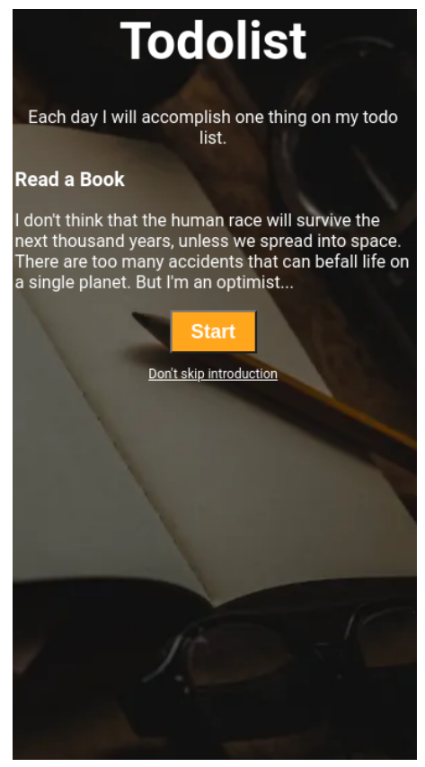

# Todolist - HTML/CSS Project

## 📝 Description

This project is a **Todolist Webpage** built using core HTML and CSS concepts including:
- Text styling
- Button styling
- Background images
- Font imports
- Layout and spacing

It demonstrates basic web development concepts and is styled to match the provided reference image as closely as possible.

---

## 🔗 Live Preview

*Link:* _Coming soon (optional)_

---

## 📸 Preview

---

## 🛠️ Technologies Used

- **HTML5**
- **CSS3**
- **Google Fonts** (`Roboto`)
- **Responsive Units** (`vw`, `vh`, `%`)

---

## 🖼️ Background Image

Used the following image as background:

```

[https://d1tgh8fmlzexmh.cloudfront.net/ccbp-static-website/todolistbg.png](https://d1tgh8fmlzexmh.cloudfront.net/ccbp-static-website/todolistbg.png)

```

---

## 🎨 CSS Design Guide

- **Font Family**: Roboto
- **Text Color**: White
- **Button Color**: Orange (`background-color: orange`)
- **Text Alignments**: Centered horizontally
- **Typography**:
  - Heading: Bold, Large
  - Subheadings & Paragraphs: Normal weight, moderate size
- **Button Styling**: Rounded edges, centered, bold white text

---

## 📁 Folder Structure

```

todolist/
├── index.html
├── styles.css
├── README.md
└── preview\.png (optional)

```

---

## 🔄 Concepts Reviewed

- Use of **Google Fonts**
- Applying **custom background images**
- Styling **buttons** and **typography**
- Working with **CSS selectors** and **class names**
- Understanding **box model** (padding, margins)
- Aligning content using **text-align**, **margin**, and **width units**

---

## ✅ Assignment Instructions Recap

- Try to **match the reference design**
- Ensure **all text is visible**
- Apply correct **fonts, sizes, and colors**
- Include **background image** from the provided URL
- Use **semantic HTML** and maintain a **clean CSS structure**

---

## 🧠 Learnings

- Structured layout with semantic HTML
- Linking external fonts
- Using `vw` and `vh` for responsive sizing
- Importance of visual hierarchy in typography
- Applying consistent styling for UI elements

---

## 🚀 Future Improvements

- Make it responsive for all screen sizes
- Add task management functionality with JavaScript
- Store tasks with local storage

---

## 📚 Resources

- [Google Fonts - Roboto](https://fonts.google.com/specimen/Roboto)
- [CSS Button Styling](https://developer.mozilla.org/en-US/docs/Web/CSS/button)
- [Background Image CSS](https://developer.mozilla.org/en-US/docs/Web/CSS/background-image)

---

## 👨‍💻 Author

Made with ❤️ while learning **HTML & CSS basics**.


